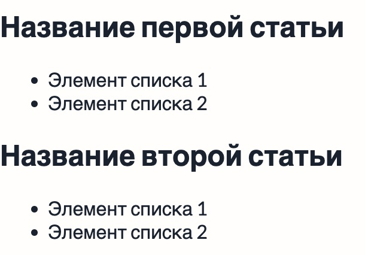

# Параметры шаблона

Иногда, нам нужно передать какие-нибудь параметры в шаблон. Возвращаясь к
примеру со статьями, это может быть название статьи, ссылка и т.д. Передадим
название статьи и ссылку в параметрах шаблона:

```pug
//- index.pug
+article({ title: 'Название первой статьи', link: '/article/12' })
+article({ title: 'Название второй статьи', link: '/article/13' })
```

Тут мы использовали шаблон статьи два раза. В первый раз, передали для него
заголовок *Название первой статьи*, во второй раз *Название второй статьи*.
Теперь, нам нужно эти параметры получить в шаблоне и правильно расставить:

```pug
//- article.pug
mixin article({ title, href })
  article.article#article-11
    h1.article__title
      a.article__link(href=href title=title) #{title}
    ul.article__list
      li.article__item Элемент списка 1
      li.article__item Элемент списка 2
```

Вот какой результат мы получаем на странице:



То есть, мы можем написать HTML один раз и потом, многократно его использовать.
В этом вся сила шаблонов.
