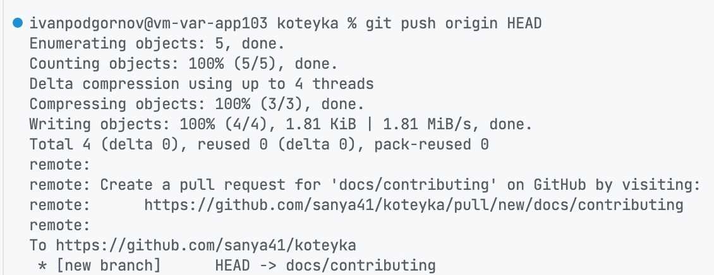
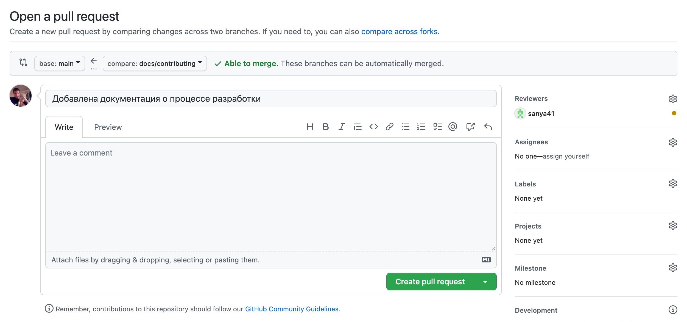
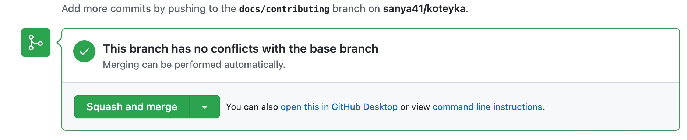

# Процесс работы

Ниже представлено описание того, как было бы удобно вести этот проект так, чтобы
всем было удобно: [ведущему разработчику](https://github.com/sanya41) и
[ментору](https://github.com/ivan-podgornov). Будем стараться делать сразу так,
как это принято в компаниях.

## Декомпозиция

Одну большую задачу (разработка сайта) разбиваем на много маленьких задач. Это
нужно, чтобы в один отрезок времени, концентрироваться на одном мелком
компоненте и не распыляться. Ну и конечно же, так легче ревьюить изменения.

С гитом и гитхабом, код можно рассматривать как слои, которые последовательно
друг на друга накладываются. В основной ветке кода - main, мы храним тот код,
который уже прошел проверку. Когда разработчик берётся за какую-нибудь задачу,
он переходит на другую ветку:

```bash
git checkout -b название
```

Нужно убедиться, что ответвление происходит от ветки main. Для этого, можно
выполнить `git branch`. Команда должна вывести *main* в консоль. Если всё делать
по этой инструкции, проблем с этим быть не должно. Название ветки должно быть
осмысленным. Например, если мы делаем блок с шапкой, ветка должна называться
feat/header. Feat - это специальная метка, которая указывает на тип изменений.
Типов есть несколько:

* **feat** - новая фишка
* **fix** - исправление существующего функционала
* **docs** - обновление документации
* **refactor** - улучшение кода, которое никак не влияет на функционал

## Фиксация изменений

Когда автор считает, что он всё сделал, ему нужно зафиксировать изменения и
отправить их на проверку. Делается это с помощью следующих команд:

```bash
git add .
git commit -m "Осмысленный комментарий с большой буквы"
```

Теперь, гиту известно о "новом слое" кода, который автор хочет наложить на тот,
что уже есть в основной ветке. Правда, гитхабу об этом ничего неизвестно. Чтобы
исправить это недоразумение, используем следующую команду:

```bash
git push origin HEAD
```

Теперь нужно сделать pull request - запрос на наложение нового слоя кода на уже
существующий. Для этого, нужно перейти по ссылке, которая выводится при пуше:
. На скриншоте, это:
*https://github.com/sanya41/koteyka/pull/new/docs/contributing*. Появится
страница, на которой желательно "призвать" ревьюера. Для этого нужно в reviewers
выбрать человека, который будет ревьюить изменения. Когда всё готово, остаётся
нажать на кнопку "Create pull request". 

## Процесс ревью

Поздравляю, pull request создан, ревьюеру пришло уведомление. Теперь он должен
просмотреть изменения и, при необходимости, оставить комментарии. Если
комментарии имеются, нужно поправить то что в них написано или как-то оспорить
(такое тоже может быть) и зафиксировать изменения с помощью уже знакомых команд:

```bash
git add .
git commit -m "Правки по комментариям" # Фиксируем изменения
git push origin HEAD # Отправляем их на гитхаб
```

После этого, нужно запросить повторное ревью. Те комментарии, которые были
исправлены, ревьюер закрывает, но нужно быть готовым к тому, что появятся новые
или неправильно были поняты старые. Это нормально. Ревьюер должен закрыть
решенные комментарии. Повторяем эти круги пока не останется ни одного
незакрытого комментария. Теперь можно заливать новый слой изменений в основную
ветку. Важно делать это именно с кнопки Squash and merge, а не Merge или Rebase:


## Поздравляю

Поздравляю! Новый слой кода готов и он в основной ветке. Но не стоит торопиться,
осталось сделать одно небольшое действие - подтянуть основную ветку с гитхаба к
себе на компьютер:

```bash
git checkout main # перешли на основную ветку
git pull origin main # подтянули изменения
```

Теперь точно всё! Можно радоваться жизни.
